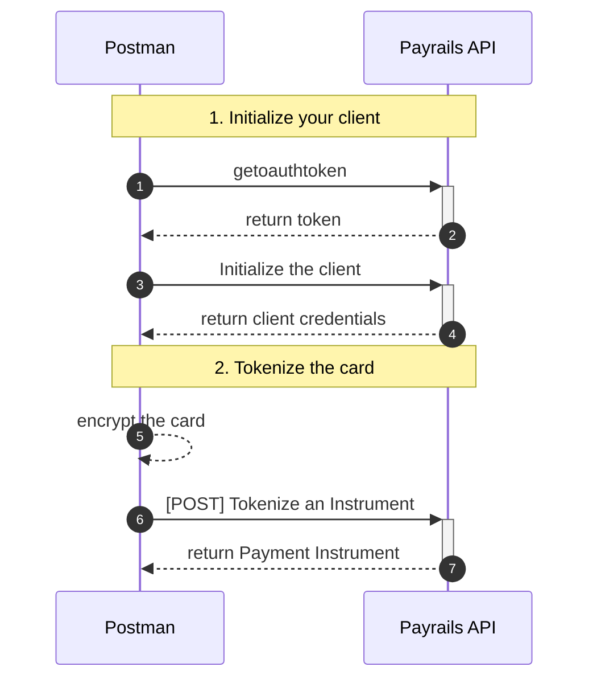

# Payrails Product assessement

Welcome to the Payrails Product assessement! This repository contains all the resources you need to complete the Payrails Product assessment.

This assessment is part of the application process for the position of [(Sr) Product Manager](./job-description.md) at Payrails.

> [!IMPORTANT]
> Read this page very carefully to understand the precise expectations before you get started.

## Goal

Create a Postman collection that implements the necessary calls to successfully tokenize an instrument via Payrails using Client Side Encryption.

## Setup & Resources

These are the resources and tooling you will need to successfully deliver your assessment.

### Payrails documentation

Payrails documentation is available [here](https://docs.payrails.com/). It contains:

- [Guides / tutorials](https://docs.payrails.com/docs)
- [API reference](https://docs.payrails.com/reference/)

> [!NOTE]
> Beware Payrails is a complex product supporting many features and flows. You should probably follow the assessment steps and cherry-pick what you need from the documentation, rather than going head first into understanding all Payrails concepts from the documentation.

### Mockoon

[Mockcoon](https://mockoon.com/) is a simple API mock server you can run locally to simulate Payrails API for this exercise.

Install [Mockoon Desktop](https://mockoon.com/download/), import [mockoon.json](./mockoon.json) and `run` the environment.

## Sequence of steps

Here's the sequence of steps the card tokenization will follow:



### 1. Initialize your client

#### 1.1 Request access token

First, you must authenticate yourself to Payrails in order to fetch the Client Side Encryption credentials. Use the [Request access token](https://docs.payrails.com/reference/getoauthtoken) endpoint for that matter.

Make sure the `x-api-key` is correctly set for your request(s), otherwise you'll receive a `401 - Unauthorized` error.

Save the `access_token` value in the Response, you will now use it to authenticate the next API call to fetch the client credentials.

#### 1.2 Initialize the client

Your are going to call the [Initialize a client SDK](https://docs.payrails.com/reference/clientinit) with:

- the bearer token you saved from the [1.1 Request access token](#11-request-access-token) as an `authorization` Header
- the request body parameter `type` set for Client Side Encryption:

```json
{
  "type": "tokenization",
  "holderReference": "some customer reference"
}
```

Payrails API will return all configurations to initialize your client in the `data` field as a `base64` string. Take the value and decode it (There are many ways to do that using online tools such as [Jam.dev](https://jam.dev/utilities)).

After decoding the data, you obtain a JSON object. You will need the following values for tokenization:

- `holderReference`
- `tokenization.publicKey`

### 2. Tokenize the card

#### 2.1 Encrypt the card

Below is the structure expected, you can use any test card number you prefer:

```json
{
  "cardNumber": "4111111111111111",
  "expiryMonth": "03",
  "expiryYear": "30",
  "securityCode": "737",
  "holderName": "John Doe",
  "holderReference": "customer123"
}
```

Encrypt the full json of the payment details with the public returned in the previous step.

- The public key is a PKCS8 RSA public key in `PEM`` format without header and line breaks.
- The encrypted data should be encrypted using JWE with encryption algorithm `RSA-OAEP-256` and content encryption `A256CBC-HS512`.

You can find some examples how to encrypt payment details with the public key given by Payrails [here](https://docs.payrails.com/docs/tokenize-cards-with-api-only).

#### 2.1 Create a Payment Instrument

Call the tokenization endpoint with the encrypted payment details.

```json
{
  "holderReference": "some customer reference",
  "encryptedInstrumentDetails": "your encrypted card data",
  "futureUsage": "CardOnFile",
  "storeInstrument": true
}
```

To ensure successful tokenization, please verify that the holder reference provided in the encrypted instrument details matches the holder reference sent in the body request. If the references do not match, the tokenization process will be rejected.

## Expectations

1. Use Postman to build the API collection.
2. Export your postman collection and push it to a git repository (provide the git repo url in your submission)
3. Prepare yourself for an online demo.

## Last advice before you get started

- **We evaluate if you can follow instructions and get stuff done!** So focus on the above instructions and do not waste too much time on the GUI or the code quality.
- **Are you stuck?** It's fine to research on Stackoverflow and ChatGPT. But beware to understand what you're pasting because we will code review together and ask questions!
- **Don't give up!** The mock server is permissive, it will never complain! Therefore if you get stuck at a step, don't give up! Keep going with the rest of the assessment and we will debrief during the review what was your blocker.

## Support

If your have questions or if you are facing issues with the tooling, please reach out to Payrails People Partner in charge of your application via email.
